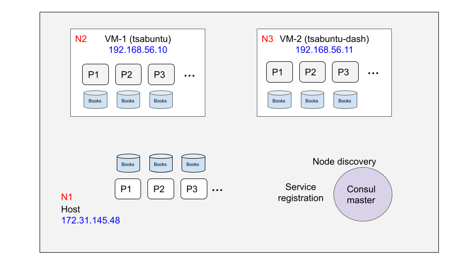

# Distributed book store
Mini-project 2: Building a distributed online book store with underlying chain replication LTAT.06.007

**Authors:** Davis Krumins


### Requirements
1. Consul

## How to run

1. Install pip requirements:
```
pip install -r requirements.txt
```

2. Generate the gRPC python files:
```
python3 -m grpc_tools.protoc -I . --python_out=. --grpc_python_out=. bookstore.proto
```

3. Fill in the config.json file, where you need to specify your host IP address to advertise to other nodes.

4. Start the master node:
```
consul agent --server --config-file consul_conf.json
```
5. On other machines (nodes) that are in the same LAN:

- Fill the config.ini with the appropriate IP addreses
- Generate gRPC python files
- Start the cluster node: `python3 main.py`


